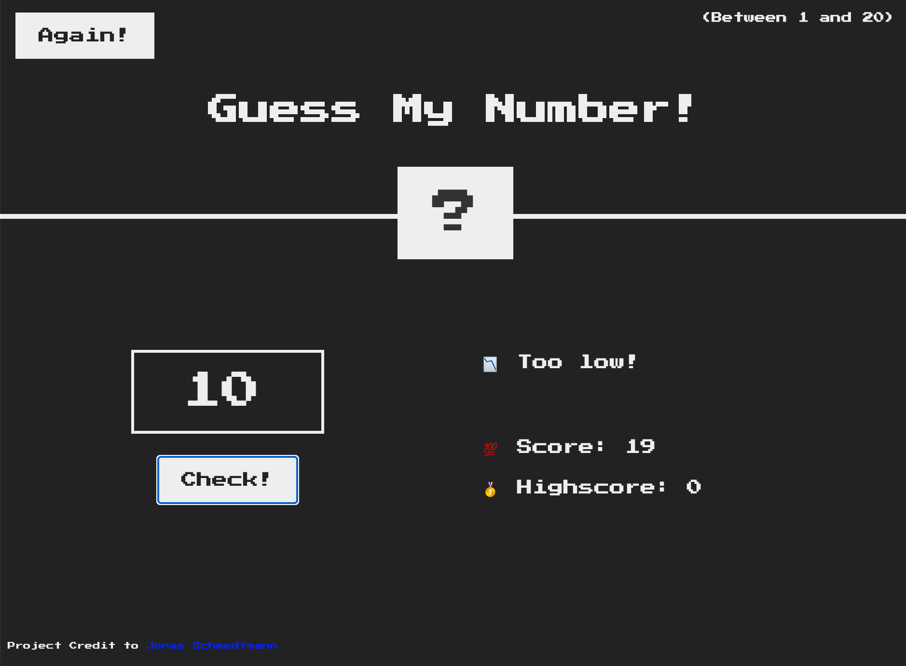

# 🔎 Guess My Number
Basic Javascript DOM manipulation Guess My Number Game

* Create a random number
* Get userInput() from DOM
* Use comparison statements to compare the userInput value to the random number generated
* Create response in relation to comparison outcome

### View Project here

[Play Guess My Number](http://github.com)

